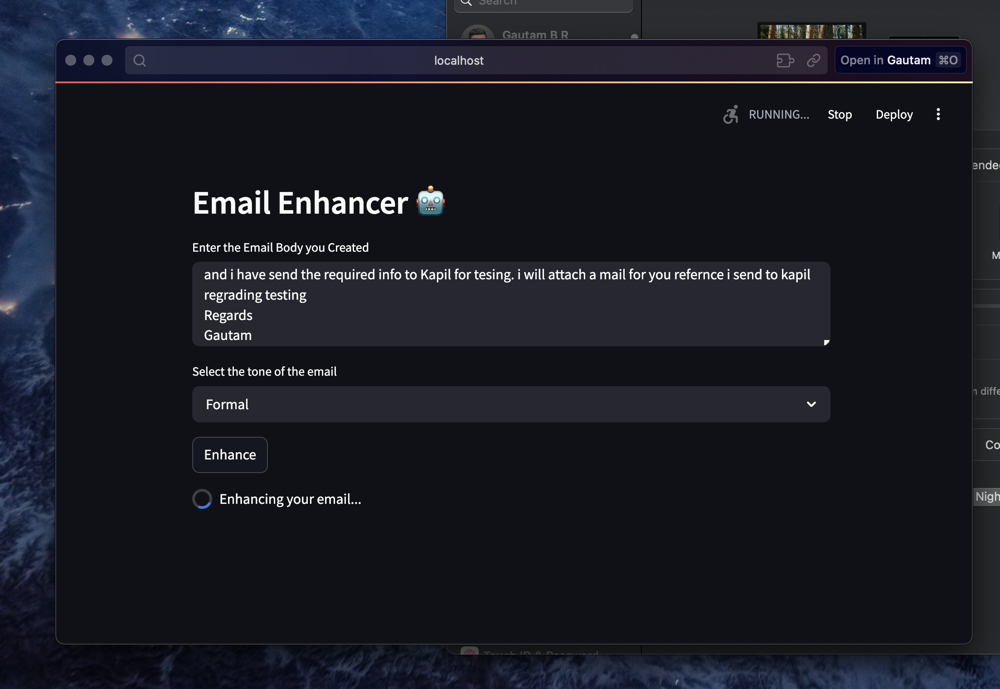

# ✉️ Email Enhance: Grammar, Spelling & Tone Correction using LLMs

**Email Enhance** is a web-based application built with **Streamlit** that helps users improve the **grammar**, **spelling**, and **tone** of their emails. This application runs locally using selected **LLM (Large Language Model)** architectures that best suit your system's computational capabilities.

---

## 🚀 Features

- Grammar and spelling correction  
- Tone adjustment for professional, formal, or casual emails  
- Option to switch between models depending on performance and results  
- Simple and interactive Streamlit UI  

---

## 🧠 Models Used

Depending on your system's performance, choose from the following LLMs:

1. **Llama-3-OffsetBias-8B-GGUF**  
   [🔗 View on Hugging Face](https://huggingface.co/RichardErkhov/NCSOFT_-_Llama-3-OffsetBias-8B-gguf)

2. **Llama 3.1 - 8B Instruct** by Meta  
   [🔗 View on Hugging Face](https://huggingface.co/meta-llama/Llama-3.1-8B-Instruct)

3. **Phi-4 Mini Instruct** by Microsoft  
   [🔗 View on Hugging Face](https://huggingface.co/microsoft/Phi-4-mini-instruct)

---

## 🛠️ Installation & Setup

1. **Download** your preferred model and unzip it into a designated folder.

2. **Open VS Code** and run the following commands to set up a virtual environment:

   ```bash
   conda create -p venv python==3.11.7 --yes
   conda activate ./venv
   pip install -r requirements.txt
   ```

3. **Choose a model**  
   In the Python code, uncomment the model you'd like to use.

4. **Run the Streamlit app**

   ```bash
   streamlit run application.py --server.fileWatcherType none
   ```

---

## ⚠️ Challenges Faced

### 1. Model Selection  
Choosing the best model was a manual and iterative process. Hugging Face provides a vast collection, but identifying a model suited for **text-to-text generation** with limited resources required experimentation.

### 2. Prompt Engineering  
Effective prompts are critical when using LLMs locally due to resource constraints. I explored prompt engineering techniques to optimize performance and designed **single-shot prompts** that include clear instructions and proper stopping cues to avoid unnecessary repetition.

---

## 📚 References & Resources

- [Token Optimization: The Backbone of Effective Prompt Engineering](https://developer.ibm.com/articles/awb-token-optimization-backbone-of-effective-prompt-engineering/)
- [What is Tokenization in NLP?](https://www.analyticsvidhya.com/blog/2020/05/what-is-tokenization-nlp/)
- [End-to-End LLM Project using LLAMA 2 – YouTube Tutorial](https://www.youtube.com/watch?v=cMJWC-csdK4)

---

## 📌 Notes

- Ensure the downloaded models are compatible with your hardware.
- Experiment with different models to find the optimal balance of performance and result quality.
- This project is ideal for learning how to deploy LLMs locally and practice prompt engineering.

---

## 📷 Model Preview


